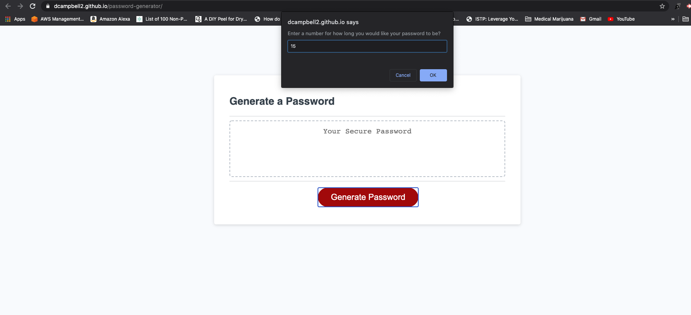

# password-generator

## ABOUT

This project allows the end user to dynamically generate a password using special characters upper case letters lower case letters and whole numbers.

## USAGE

When you navigate to the site here - https://dcampbell2.github.io/password-generator/ and click the "Generate Password" button you'll be prompted to enter in a number. This number represents the length of your password.

If your input is less than 8 or more than 129 you will be alerted of the acceptable length and will need to re-input a new length for your password.

After inputting your desired length you'll need to click through the series of prompts asking you to click "OK" to confirm the use of the characters for your password.

Once finished you will be presented with a password of your specified length with the specified character types.

## Credit
Stackoverflow
MDN(Mozilla Developer Network)
W3Schools

## Screenshots
